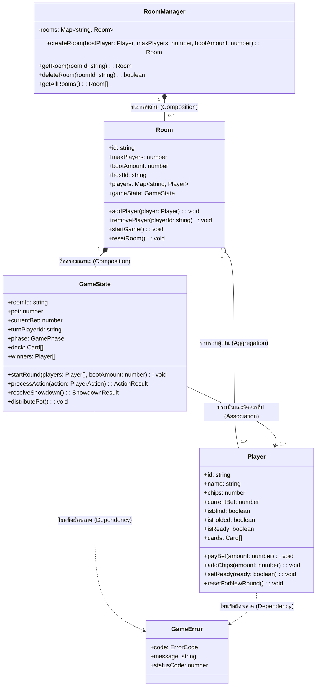
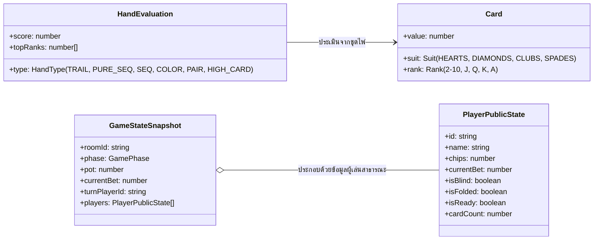

# Class Diagrams & System Relationships (แผนภาพคลาสและความสัมพันธ์ของระบบ)

เอกสารฉบับนี้จัดทำขึ้นเพื่ออธิบายการออกแบบเชิงวัตถุ (Object-Oriented Design) แสดงโครงสร้างคลาส (Classes), อินเทอร์เฟซ (Interfaces) และความสัมพันธ์ระหว่างคอมโพเนนต์ภายในระบบ **Indian Poker Online (Teen Patti)** ตามข้อกำหนดการส่งมอบงาน

---

## 1. แผนภาพคลาสระดับโดเมน (Domain Class Diagram)

สถาปัตยกรรมฝั่งเซิร์ฟเวอร์ใน `01-Source-code/server/domain/` ได้รับการออกแบบตามหลักการห่อหุ้มข้อมูล (Encapsulation) และการแบ่งแยกหน้าที่ความรับผิดชอบ (Single Responsibility Principle):

### คำอธิบายหน้าที่และความรับผิดชอบของแต่ละคลาส (Class Responsibilities)

| คลาส (Class)      | เลเยอร์ / ตำแหน่งไฟล์     | หน้าที่ความรับผิดชอบหลัก                                                                                                                                                              |
| :---------------- | :------------------------ | :------------------------------------------------------------------------------------------------------------------------------------------------------------------------------------ |
| **`RoomManager`** | `server/domain/services/` | จัดการสารบบห้องแข่งขันส่วนกลาง (Lobby Registry) ให้บริการสร้าง ค้นหา ลบ และแสดงรายการห้องแข่งขันทั้งหมดในเซิร์ฟเวอร์                                                                  |
| **`Room`**        | `server/domain/models/`   | บริบทของห้องแข่งขัน (Game Session Context) ควบคุมผู้เข้าร่วมห้อง กำหนดค่าธรรมเนียม Boot และควบคุมวงจรชีวิตการเริ่มรอบใหม่                                                             |
| **`Player`**      | `server/domain/models/`   | เอนทิตีผู้เล่น (Domain Entity) ห่อหุ้มข้อมูลส่วนบุคคล เช่น ชิป (`chips`), เงินเดิมพันสะสม (`currentBet`), สถานะความพร้อม (`isReady`), สถานะการหมอบ (`isFolded`) และไพ่ในมือ (`cards`) |
| **`GameState`**   | `server/domain/models/`   | ตัวควบคุมวัฏจักรสถานะเกม (Game Lifecycle Controller) จัดการลำดับเทิร์น ตรวจสอบความถูกต้องของการกระทำ (Actions) คำนวณเงิน Pot และตัดสินผล Showdown                                     |
| **`GameError`**   | `server/domain/errors/`   | คลาสข้อยกเว้นทางธุรกิจ (Domain Exception) สืบทอดจากคลาส `Error` มาตรฐาน เพื่อระบุรหัสข้อผิดพลาดและบริบทเมื่อเกิดการละเมิดกติกา                                                        |

### คำอธิบายความสัมพันธ์เชิงสถาปัตยกรรม (Relationship Types)

1. **ความสัมพันธ์แบบประกอบขึ้น (Composition - `*--`):**
   - `RoomManager` กับ `Room`: คลาส `RoomManager` เป็นผู้สร้างและถือครองออบเจกต์ `Room` หากเซิร์ฟเวอร์ถูกรีเซ็ตหรือตัวจัดการห้องถูกทำลาย ห้องแข่งขันทั้งหมดจะสิ้นสุดลง
   - `Room` กับ `GameState`: ในหนึ่งห้องแข่งขันจะมีอินสแตนซ์ของ `GameState` ประจำอยู่ 1 อินสแตนซ์ตลอดอายุของห้อง
2. **ความสัมพันธ์แบบรวมกลุ่ม (Aggregation - `o--`):**
   - `Room` กับ `Player`: ห้องแข่งขันรวบรวมผู้เล่นจำนวน 1 ถึง 4 คน โดยที่ตัวตนของผู้เล่น (`Player`) ไม่ได้ผูกติดกับห้องอย่างถาวร สามารถออกจากห้องหรือย้ายห้องได้
3. **ความสัมพันธ์แบบเชื่อมโยง (Association - `-->`):**
   - `GameState` กับ `Player`: `GameState` อ้างอิงออบเจกต์ `Player` เพื่อตรวจสอบสถานะในแต่ละเทิร์น หักเงินเดิมพัน และมอบเงินรางวัลใน Pot เมื่อสิ้นสุดรอบ
4. **ความสัมพันธ์แบบขึ้นต่อกัน (Dependency - `..>`):**
   - เมธอดต่างๆ ใน `GameState` และ `Player` มีการพึ่งพาคลาส `GameError` เพื่อโยนข้อผิดพลาดในกรณีที่เกิดข้อมูลผิดรูปแบบหรือการกระทำผิดกติกา

---

## 2. โครงสร้างข้อมูลร่วมและสัญญาการสื่อสาร (Shared Interfaces & Types)

กำหนดไว้ใน `01-Source-code/shared/` เพื่อเป็นสัญญาข้อมูลกลาง (Single Source of Truth) ระหว่างเซิร์ฟเวอร์และไคลเอนต์:

### สาระสำคัญของสัญญาข้อมูล (Contract Significance):

- **`PlayerPublicState`:** โครงสร้างข้อมูลผู้เล่นที่เปิดเผยต่อสาธารณะ โดยจะตัดข้อมูลไพ่ส่วนตัว (`cards`) ออกและแสดงเพียงจำนวนใบไพ่ (`cardCount`) เพื่อรักษาความลับและป้องกันการดักจับข้อมูลไพ่ของคู่แข่ง
- **`GameStateSnapshot`:** ชุดข้อมูลสถานะปัจจุบันที่เซิร์ฟเวอร์บรอดแคสต์ส่งให้ไคลเอนต์ทุกคนใช้ในการเรนเดอร์หน้าจอเกม

---

## 3. เอกสารและแผนภาพอ้างอิงความละเอียดสูง (Diagram & UML Assets)

สามารถตรวจสอบแผนภาพต้นฉบับและภาพประกอบความละเอียดสูงได้ที่ไดเรกทอรี `03-Documentation/`:

### 3.1 แผนภาพสถาปัตยกรรมระบบ (System Architecture Diagrams):

- [1. Server Architecture & Game Domain](../Diagram/1.Server%20Architecture%20%26%20Game%20Domain.png)
- [2. Core Game Logic & Schema Engine](../Diagram/2.Core%20Game%20Logic%20%26%20Schema%20Engine.png)
- [3. Client Architecture & UI State](../Diagram/3.Client%20Architecture%20%26%20UI%20State.png)

### 3.2 แผนภาพ UML รายโมเดล (Detailed UML Diagrams):

- [GameState UML Diagram](../UML/GameState_UML.png)
- [Player UML Diagram](../UML/Player_UML.png)
- [RoomManager UML Diagram](../UML/RoomManager_UML.png)
- [GameLogic UML Diagram](../UML/GameLogic_UML.png)
- [SocketHandler UML Diagram](../UML/Soket_Handler_UML.png)
- [Shared Types & Network Contracts](../UML/Shared%20Types%20%26%20Network%20Contracts_UML.png)
