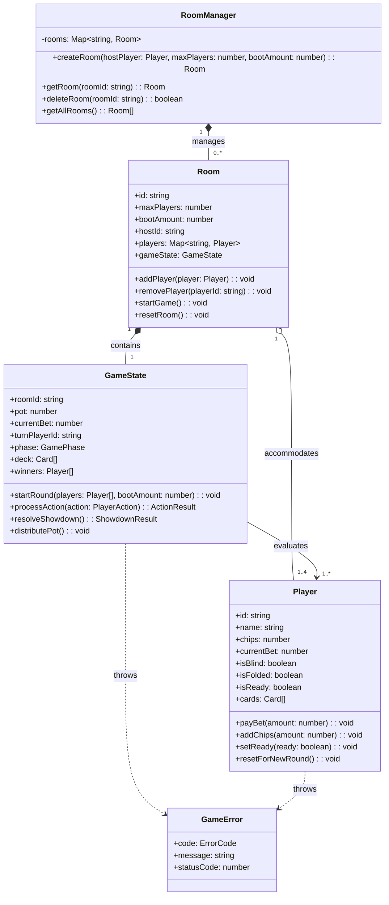
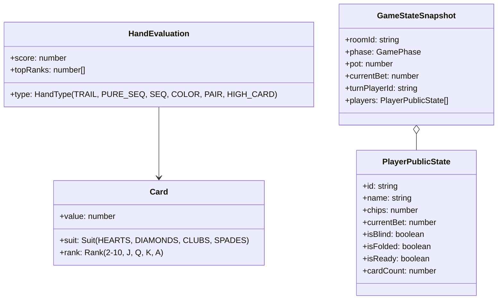

# Class Diagrams & System Relationships (แผนภาพคลาสและความสัมพันธ์ของระบบ)

เอกสารฉบับนี้อธิบายโครงสร้างเชิงวัตถุ (Object-Oriented Design) แสดงรายละเอียดของคลาส (Classes), อินเทอร์เฟซ (Interfaces) และความสัมพันธ์ระหว่างคอมโพเนนต์ภายในระบบ **Indian Poker Online**

---

## 1. แผนภาพคลาสระดับโดเมน (Domain Class Diagram)

ระบบออกแบบโดเมนหลักใน `01-Source-code/server/domain/` โดยจำแนกตามหลักการห่อหุ้มข้อมูล (Encapsulation) และการแบ่งแยกหน้าที่:

---

## 2. โครงสร้างข้อมูลร่วมและสัญญาการสื่อสาร (Shared Interfaces & Types)

กำหนดไว้ใน `01-Source-code/shared/` เพื่อเป็น Single Source of Truth สำหรับ Client และ Server:

---

## 3. แผนภาพประกอบเพิ่มเติม (Diagram & UML Assets)

สามารถศึกษาแผนภาพอย่างละเอียดเพิ่มเติมได้ที่ไดเรกทอรี `03-Documentation/`:

- **System Architecture Diagrams:**
  - [1. Server Architecture & Game Domain](../Diagram/1.Server%20Architecture%20%26%20Game%20Domain.png)
  - [2. Core Game Logic & Schema Engine](../Diagram/2.Core%20Game%20Logic%20%26%20Schema%20Engine.png)
  - [3. Client Architecture & UI State](../Diagram/3.Client%20Architecture%20%26%20UI%20State.png)
- **Detailed UML Diagrams:**
  - [GameState UML Diagram](../UML/GameState_UML.png)
  - [Player UML Diagram](../UML/Player_UML.png)
  - [RoomManager UML Diagram](../UML/RoomManager_UML.png)
  - [GameLogic UML Diagram](../UML/GameLogic_UML.png)
  - [SocketHandler UML Diagram](../UML/Soket_Handler_UML.png)
  - [Shared Types & Network Contracts](../UML/Shared%20Types%20%26%20Network%20Contracts_UML.png)
